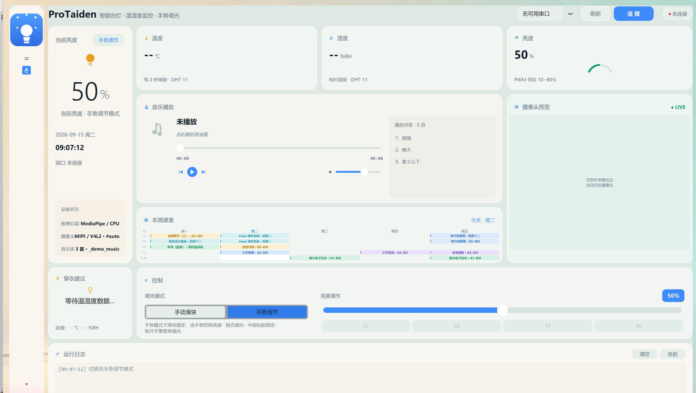

# ProTaiden · 智能台灯控制台

面向 **RK3566 嵌入式开发板**（实测 Purple Pi OH + Lubuntu 20.04）的智能台灯上位机。
一块屏把台灯该有的东西都做完：**蓝牙调光、手势控制、温湿度、音乐播放、本周课表**——
全屏触控、无鼠标指针，界面是**磨砂玻璃**风格。



> 上图为实际运行截图（自绘 logo + 示例课表）。板子上以 kiosk 全屏运行，
> 无标题栏与任务栏、触屏隐藏鼠标指针，观感与上图一致。

---

## 亮点

| | |
|---|---|
| **一份主程序，三种手势后端零改动切换** | `LAMP_INFER=npu` 走 RKNN(NPU)、`=mp` 走 MediaPipe(CPU)、`LAMP_NO_CAMERA=1` 完全不加载摄像头。切换只靠环境变量，UI / 蓝牙 / 手势规则全部复用 |
| **MediaPipe → NPU 实测提速 3.9×** | 单帧推理 **293ms → 74.4ms**；再加检测节流（每 3 帧才全图找手）**47.6ms/帧**，已越过摄像头 15fps 上限；程序 CPU 占用 1.01 核 → **0.5 核** |
| **纯 stdlib 手写的 RKNNLite** | 官方 `rknn-toolkit-lite2` 只有 GitHub Release 的 aarch64 wheel，镜像全挂时拿不到 → 按 `rknn_api.h` 用 ctypes 直接封装，接口与官方一致 |
| **Tk 也能做磨砂玻璃** | Tk 没有真透明：按每张卡片压住的背景图区域取平均色、再与白色高比例混合，模拟玻璃透光；卡片内外分层（普通面 / 内嵌面）做出层次 |
| **音乐播放器不依赖第三方包** | 后端走 **mpv 的 JSON IPC**（unix socket 发命令），ID3v2（歌名/歌手/内嵌封面）**自己解析**，兼容 v2.2/v2.3/v2.4 |
| **kiosk 一体机形态** | 全屏盖住任务栏与标题栏、触屏隐藏鼠标指针（`cursor="none"`）、左下角一枚「退出」回桌面；开机自启 + 自动锁分辨率 |
| **软 / 硬 / 固件全套开源** | 上位机（Python）+ 下位机固件（STM32F103，全程非阻塞状态机）+ 电路（Ø98mm 圆板 Gerber/BOM），照单可复刻整台 |

---

## 硬件

| 部件 | 型号 / 说明 |
|---|---|
| 主控板 | Purple Pi OH（RK3566，4×Cortex-A55 @1.8GHz，0.8TOPS NPU） |
| 系统 | Ubuntu 20.04 / Lubuntu（LXDE 桌面） |
| 屏幕 | HDMI 1920×1080（或 1280×800 也可，界面自适应） |
| 摄像头 | MIPI OV5648（`/dev/video0`，需 unbind/bind 重绑）或 USB UVC（`/dev/video9`，更省事） |
| 蓝牙 | HC-05 串口蓝牙模块（PIN 1234，走 RFCOMM socket 直连，无需 `/dev/rfcomm0`） |
| 下位机 | **STM32F103C8T6 最小系统板**，插在拓展板上；固件见 [`firmware/`](firmware/) |
| 拓展板 | **自绘 Ø98mm 圆形双层板**：DC 输入 + 降压 + MOS 调光 + DHT-11 + HC-05 + OLED + 蜂鸣器 |
| 音频 | 板载 codec（RK809）或 HDMI，PulseAudio |

> **下位机的电路与固件都在本仓库里**：电路（Ø98mm 圆板的 Gerber / BOM / 原理图）见
> [`hardware/`](hardware/)，STM32 固件（Keil 工程）见 [`firmware/`](firmware/)，
> 串口协议见 [`docs/protocol.md`](docs/protocol.md)。
> 于是这个项目**可以从零复刻一整台**——打板 → 烧固件 → 装上位机，三步到位。

---

## 快速开始

### 1. 先在开发机上看 UI（不开摄像头）

```bash
pip install customtkinter pyserial Pillow numpy
LAMP_NO_CAMERA=1 python3 desk_lamp_gui_linux.py
```

界面会直接起来（Windows / macOS / Linux 都可以），只少了手势功能。

### 2. 板端部署

```bash
git clone <本仓库> ~/protaiden && cd ~/protaiden
pip3 install -r requirements.txt          # 板上建议用 conda/venv，见 docs/troubleshooting.md
sudo apt install mpv                      # 音乐播放用
./npu/fetch_models.sh                     # 下载 NPU 模型与 librknnrt（不分发大文件）
./scripts/protaiden-start.sh              # 启动
```

### 3. 三种手势后端

```bash
# A. NPU（推荐，需要先跑 fetch_models.sh）
LAMP_INFER=npu ./scripts/protaiden-start.sh

# B. MediaPipe / CPU（跑得动但慢，293ms/帧）
LAMP_INFER=mp  ./scripts/protaiden-start.sh

# C. 不要手势（启动最快，只保留滑块调光）
LAMP_NO_CAMERA=1 ./scripts/protaiden-start.sh
```

调试期打开 `LAMP_NPU_DEBUG=1` 会打印关键点置信度与值域，方便对照。

### 4. 蓝牙调光（HC-05）

```bash
# 板端先配对一次（PIN 1234），MAC 写进文件即可被启动脚本读取
echo "AA:BB:CC:DD:EE:FF" > ~/.lamp_bt_mac
```

主程序支持三种端口写法：`/dev/ttyUSB0`（普通串口）、`bt:MAC`（RFCOMM 直连）、
`socket://127.0.0.1:8888`（配 `bt_bridge.py`，给不支持 `AF_BLUETOOTH` 的解释器用）。

### 5. 音乐

把音频丢进 `~/Music`（或设 `LAMP_MUSIC_DIR`），界面上的音乐卡会自动列出并解析封面。

### 6. 开机自启 + kiosk

```bash
mkdir -p ~/.config/autostart
cp scripts/protaiden.desktop ~/.config/autostart/   # 记得改里面的路径

# 顺手把 HDMI 锁到 1080p（很多屏开机默认回落到 1280×800）
cat > ~/.config/autostart/lamp-resolution.desktop <<'EOF'
[Desktop Entry]
Type=Application
Name=HDMI 1080p
Exec=xrandr --output HDMI-1 --mode 1920x1080 --rate 60
EOF
```

启动脚本默认 `LAMP_KIOSK=1`（全屏）与 `LAMP_HIDE_CURSOR=1`（触屏藏指针）。

### 7. 下位机固件（要实体调光/温湿度才需要）

用 Keil MDK 5 打开 [`firmware/Project.uvprojx`](firmware/)，直接编译下载：

```
F7 编译 → F8 用 ST-Link/J-Link 下载
```

> ⚠️ 源码统一为 **UTF-8**：请把 `Edit → Configuration → Editor → Encoding`
> 设为 UTF-8，否则中文注释会乱码。
> 想用串口 ISP 烧录，先勾选 `Options for Target → Output → Create HEX File`。

引脚分配、串口协议、软启动/死区等设计要点见 [`firmware/README.md`](firmware/README.md)。

---

## 从 MediaPipe 迁到 NPU：踩过的 7 个坑

这部分是本项目最值钱的经验，都真踩过：

| # | 坑 | 现象 / 解法 |
|---|---|---|
| 1 | **模型输出顺序与官方不一样** | 转出来的 landmark 模型是 `landmarks / presence / handedness / world`，而 MediaPipe 官方是 `landmarks / handedness / presence / world`。按官方顺序取第 2 个单值 → 拿到的是**手性 0.0018**，每帧都被判成"没检测到手"，手势完全不触发。改成 `score = max(单值)`，不依赖顺序 |
| 2 | **关键点坐标要不要 ×224** | 不同转换版本差一个量级。别猜：打印输出值域，并用真值域自适应（值 ≤1 视为归一化） |
| 3 | **"复用上一帧结果"引入系统性跳变** | 检测节流时，非检测帧的 ROI 用了"上一帧关键点包围盒"，而检测帧用的是"手掌框×2.6"，两套构图来回切 → 21 个点极差 **326 像素**（肉眼"乱跳"）。同图连跑 10 次才暴露。改成两帧复用同一个检测框后**极差 0.000** |
| 4 | **老驱动也能跑新模型** | 板端 RKNPU 驱动 v0.8.2 直接加载 toolkit2 2.3.2 转的 `.rknn` 成功（4 组组合全部 `rknn_init → 0`），不必重转 |
| 5 | **官方 Python 包拿不到** | `rknn-toolkit-lite2` 的 wheel 只在 GitHub Release 发布，国内镜像全挂 → 按 `rknn_api.h` 自写 ctypes 封装（本项目 `npu/rknn_lite_ctypes.py`） |
| 6 | **系统 Python 没有 numpy** | 手势依赖装在 conda 环境里，得用对应解释器跑（启动脚本用 `LAMP_PY` 指定） |
| 7 | **布局被 CTkFrame 默认高度撑爆** | `pack_propagate(False)` 固定宽度时，CTkFrame 会保留默认 **200px 高**，把整行挤掉导致按钮被裁一半。必须同时显式给 `height=1` |

排查手法也顺手记一下：给程序加 `LAMP_UI_DEBUG=1` 打印每张卡的**自然尺寸 vs 实际尺寸**，
一眼就能看出是谁把行撑爆的——比反复改代码猜快得多。

---

## 目录结构

```
protaiden/
├─ desk_lamp_gui_linux.py    # 主程序：UI(2600 行) + 串口协议 + 手势规则 + 玻璃主题
├─ music_player.py           # 音乐后端：mpv JSON IPC + ID3v2 解析（纯 stdlib）
├─ bt_bridge.py              # 蓝牙 RFCOMM ⟷ 本地 TCP 桥（给无 AF_BLUETOOTH 的解释器用）
├─ npu/
│   ├─ hand_npu.py           # 与 mp.solutions.hands 接口兼容的 NPU 手部推理层
│   ├─ rknn_lite_ctypes.py   # 自写的 ctypes 版 RKNNLite
│   ├─ run_npu.py            # 后端注入器：改 mp.solutions.hands 再加载主程序
│   └─ fetch_models.sh       # 下载模型与 librknnrt（不随仓库分发）
├─ hardware/                 # 下位机电路：Ø98mm 圆板 Gerber + 飞针文件 + BOM
├─ firmware/                 # 下位机固件：STM32F103C8T6（Keil 工程，非阻塞状态机）
├─ assets/                   # 示例课表 / logo / 背景图
├─ scripts/                  # 启动、开机自启、桌面图标、摄像头、调优脚本
└─ docs/                     # 硬件接线、串口协议、NPU 迁移、排坑
```

### 换成你自己的东西

| 文件 | 说明 |
|---|---|
| `assets/schedule.json` | 课程表。`day` 0=周一 … 4=周五，`start`/`end` 是节次 |
| `assets/bg.jpg` | 磨砂玻璃卡片下方的背景图（程序按它取色，换任何图都能用） |
| `assets/logo.png` | 左上角 logo；删掉则自动回退成程序里画的灯泡图标 |
| `~/Music/` | 音乐目录，可用 `LAMP_MUSIC_DIR` 改 |

---

## 常用环境变量

| 变量 | 默认 | 作用 |
|---|---|---|
| `LAMP_INFER` | `npu` | 手势后端：`npu` / `mp` |
| `LAMP_NO_CAMERA` | – | `1` = 不加载摄像头与推理（启动最快） |
| `LAMP_DETECT_EVERY` | `3` | 每 N 帧重新全图找手（1=最跟手最费，5=最省） |
| `LAMP_SMOOTH` | `0.6` | 关键点 EMA 平滑系数（1.0 = 关闭） |
| `CAM_INDEX` / `CAM_FOURCC` / `CAM_BUFSIZE` | 自动 | 摄像头节点 / 像素格式 / V4L2 缓冲数 |
| `LAMP_PY` | `python3` | 主程序用哪个解释器（依赖装在哪就指哪） |
| `LAMP_MUSIC_DIR` | `~/Music` | 音乐目录 |
| `LAMP_KIOSK` | `1` | 全屏（盖住任务栏/标题栏） |
| `LAMP_HIDE_CURSOR` | `1` | 触屏隐藏鼠标指针 |
| `LAMP_UI_DEBUG` | – | `1` = 打印各卡自然/实际尺寸 |

---

## 许可

| 部分 | 许可证 |
|---|---|
| 软件（`.py` / `.sh` / 脚本） | **Apache-2.0**，见 [LICENSE](LICENSE) |
| 固件（[`firmware/`](firmware/)，本项目所写部分） | **Apache-2.0** |
| 硬件（[`hardware/`](hardware/) 下的电路设计与制板文件） | **CERN-OHL-S v2**（若已在立创开源广场发布，以其标注协议为准） |

固件里的 ST 官方库（`Library/`、`Start/`）与 OLED 驱动模板遵循各自原许可，见 [NOTICE](NOTICE)。

软硬件分别许可在开源项目里很常见：Apache-2.0 提供明确的专利授权，
CERN-OHL 则专为硬件（含制造文件）设计。**两者都允许商用**，再发布时保留署名即可。

第三方资源（**不随仓库分发**，请自行下载，各自遵循原许可）：

- 手部模型与转换产物：社区工程 [w13364/rknn-mediapipe](https://github.com/w13364/rknn-mediapipe)
  （原作者未声明许可证，**商业使用请先联系原作者**），原始模型来自 Google MediaPipe（Apache-2.0）
- `librknnrt.so` / rknn-toolkit2：[airockchip/rknn-toolkit2](https://github.com/airockchip/rknn-toolkit2)（Rockchip）
- 依赖库：CustomTkinter(MIT) / pyserial(BSD) / OpenCV(Apache-2.0) / Pillow / MediaPipe(Apache-2.0) / mpv(GPL，以子进程调用)
